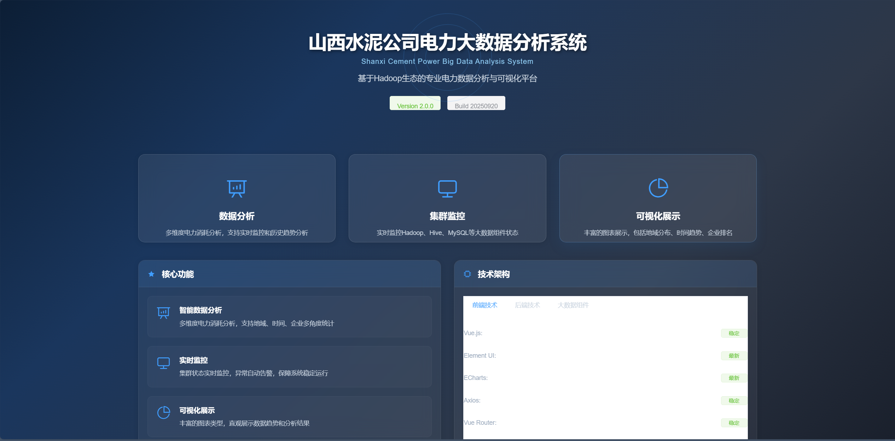
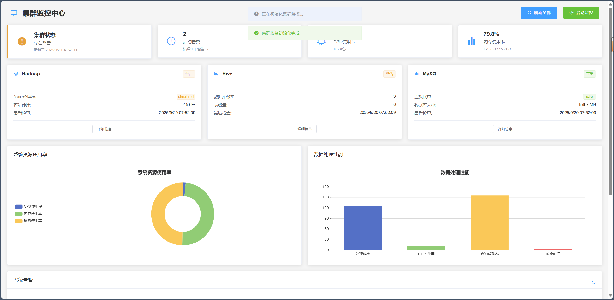
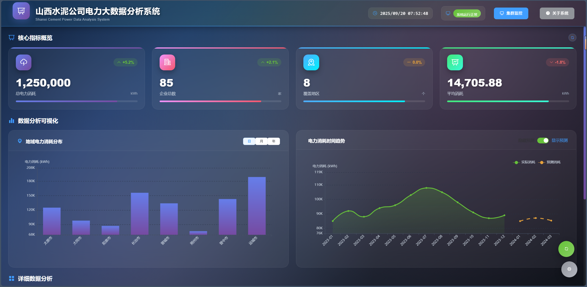
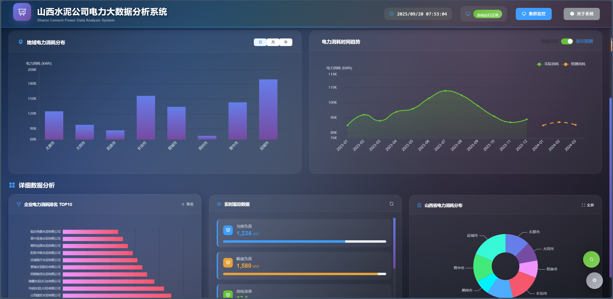

# 大数据分析平台（DataAnalysis）

一个基于 **Hadoop / Hive / Flink 大数据集群 + Flask 后端 + Vue 2 前端可视化大屏** 的完整数据分析系统。支持数据采集、清洗、分析、机器学习建模与集群状态监控。

## ✨ 功能特性

- 📊 **可视化大屏**：基于 ECharts 的数据分析仪表盘，直观展示分析结果
- 🧹 **数据清洗与处理**：pandas 全流程数据清洗（缺失值、异常值、标准化）
- 🐘 **大数据集群**：Docker Compose 一键部署 Hadoop（HDFS）+ Hive + Flink 1.13.6
- 🧠 **机器学习模块**：内置数据分析与建模能力（`modules/ml_models`）
- 🖥️ **集群监控**：实时监控 Hadoop / Flink 集群运行状态（`ClusterMonitoring` 页面）
- 🗄️ **数据存储**：MySQL 持久化 + Hive 数据仓库，支持多数据源

## 🛠️ 技术栈

| 层级 | 技术 |
| ---- | ---- |
| 前端 | Vue 2.6 · Element UI · ECharts · Vuex · Vue Router · Axios |
| 后端 | Flask · SQLAlchemy · pandas · NumPy · matplotlib / seaborn / plotly |
| 大数据 | Hadoop 3.2.1 (HDFS) · Hive 2.3.2 · Flink 1.13.6 |
| 存储 | MySQL 8 · Hive Metastore (PostgreSQL) |
| 部署 | Docker Compose · Python 3.7+ · Node.js |

## 📂 项目结构

```
items/
├── DataAnalysisProject/          # 后端 + 大数据集群
│   ├── app.py                    # Flask 应用入口 (端口 5000)
│   ├── config/                   # 配置文件 (Hadoop / Hive)
│   ├── modules/
│   │   ├── data_processing/      # 数据加载、清洗、校验
│   │   ├── data_analysis/        # 数据分析模块
│   │   ├── data_storage/         # 数据存储模块
│   │   ├── bigdata/              # Hadoop / Hive 集成
│   │   ├── ml_models/            # 机器学习模型
│   │   └── monitoring/           # 集群监控
│   ├── scripts/                  # 数据清洗、测试脚本
│   ├── deployment/               # Docker Compose 部署
│   ├── docker-compose.yml        # Hadoop + Hive 集群
│   ├── docker-compose-flink.yml  # Flink 集群
│   └── requirements.txt
└── DataAnalysisView/
    └── data_analysis_view/       # Vue 前端 (端口 8080)
        ├── src/
        │   ├── views/            # Dashboard / ClusterMonitoring / About
        │   ├── router/           # 路由配置
        │   ├── api/              # 接口封装
        │   └── components/
        └── vue.config.js         # /api 代理到 http://127.0.0.1:5000
```

## 🚀 快速开始

### 1. 启动大数据集群（Hadoop / Hive / Flink）

```bash
cd DataAnalysisProject

# 启动 Hadoop + Hive
docker-compose up -d

# 启动 Flink 集群（JobManager + 3 TaskManager，Web UI: 8081）
docker-compose -f docker-compose-flink.yml up -d
```

### 2. 启动后端 (Flask)

```bash
cd DataAnalysisProject
pip install -r requirements.txt
python app.py          # 监听 0.0.0.0:5000
```

### 3. 启动前端 (Vue)

```bash
cd DataAnalysisView/data_analysis_view
npm install
npm run serve          # 打开 http://localhost:8080
```

## 📸 运行效果

系统可视化大屏（Dashboard）：



数据分析结果展示：







## ⚙️ 环境要求

- Docker + Docker Compose
- Python 3.7+
- Node.js 14+ / npm
- MySQL 8.0（用于业务数据存储）
